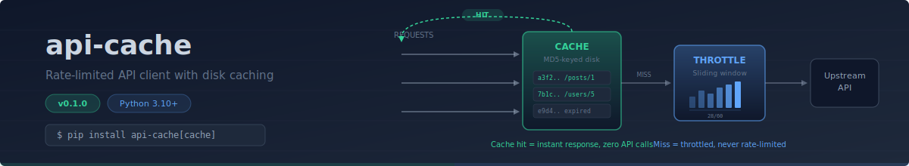
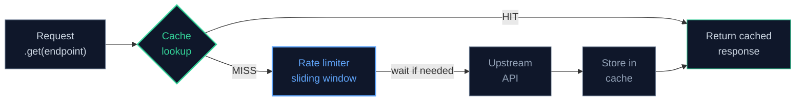

<div align="center">



</div>

# api-cache

Rate-limited HTTP client with disk caching for Python.

[](LICENSE)
[](https://www.python.org/)
[](https://github.com/protectyr-labs/api-cache/actions)
[]()

Wraps any REST API with a sliding-window rate limiter and an MD5-keyed disk cache.
Cache hits return instantly without touching the network. Cache misses pass through
the rate limiter before reaching the upstream API. The result: you stop hammering
external services, you save quota, and you never get rate-limited.

## Quick start

```bash
pip install api-cache[cache]   # with disk caching (recommended)
pip install api-cache           # rate limiting only, no disk cache
```

```python
from api_cache import CachedApiClient, RateLimitConfig, CacheConfig

client = CachedApiClient(
    base_url="https://jsonplaceholder.typicode.com",
    rate_limit=RateLimitConfig(max_requests=30, window_seconds=60),
    cache=CacheConfig(cache_dir=".cache", default_ttl=300),
)

post = client.get("/posts/1")        # hits network, caches result
post = client.get("/posts/1")        # returns cached instantly
print(client.requests_remaining)     # 29
print(client.cache_stats)            # {"enabled": True, "size": 1, "volume": 834}
```

## Architecture



Every `.get()` call follows this path. The cache check is O(1) via MD5 key lookup.
The rate limiter tracks request timestamps in a sliding window and sleeps only when
the budget is exhausted. See [ARCHITECTURE.md](ARCHITECTURE.md) for the full rationale
behind sliding windows, MD5 keys, and optional diskcache.

> [!NOTE]
> The disk cache requires the optional `diskcache` dependency. Without it, caching is
> silently disabled and the client operates as a rate limiter only.

## Use cases

**Data pipeline API calls.** Your pipeline calls 5 external APIs. Cache responses
to avoid redundant calls on reruns. Rate limiting prevents getting banned.

**Development and testing.** During development, you call the same API endpoints
repeatedly. Cache saves time and API quota.

**Multi-source aggregation.** Aggregate data from 10 sources, each with different
rate limits. One client class handles caching and throttling for all of them.

## API

| Method / Property | Purpose |
|-------------------|---------|
| `CachedApiClient(base_url, headers, rate_limit, cache)` | Create a client |
| `.get(endpoint, params, ttl, skip_cache)` | GET request with throttle + cache |
| `.requests_remaining` | Requests left in current rate limit window |
| `.cache_stats` | `{"enabled", "size", "volume"}` |
| `.clear_cache()` | Empty all cached responses |

### Configuration

```python
RateLimitConfig(
    max_requests=60,       # per window
    window_seconds=3600,   # 1 hour sliding window
    min_interval=0.5,      # minimum seconds between calls
)

CacheConfig(
    cache_dir=".cache",
    default_ttl=3600,      # seconds
    enabled=True,
)
```

### Per-request overrides

```python
# Short TTL for volatile data
client.get("/prices", ttl=60)

# Bypass cache entirely for this call
client.get("/status", skip_cache=True)
```

## Design decisions

- **Sliding window over fixed window.** Fixed windows allow burst-then-blocked behavior
  at interval boundaries. Sliding window tracks actual timestamps, producing smoother
  traffic. The O(n) memory cost per tracked request is negligible for typical API limits
  (60-1000/hour).

- **MD5 cache keys over raw strings.** Cache keys are MD5 hashes of
  `endpoint + sorted(params)`. This produces compact, filesystem-safe, deterministic keys
  regardless of parameter ordering. MD5 collision risk is irrelevant at cache-key scale.

- **Optional diskcache over in-memory dict.** In-memory caches die on process restart.
  For periodic jobs (cron, CI pipelines), persistence across runs avoids redundant API
  calls. Making diskcache optional keeps the base install at zero dependencies.

- **Synchronous over async.** Uses `urllib.request` for zero external dependencies and
  predictable behavior. For async workloads, wrap with `asyncio.to_thread()`.

## Limitations

- Synchronous only (no async support)
- GET requests only (POST/PUT/PATCH are not cached)
- Single-process rate limit (in-memory counter, not shared across processes)
- No per-key cache invalidation (clear all or nothing)
- No retry/backoff logic (left to the caller)

## Origin

This module was extracted from a production security automation platform that aggregates
data from multiple vendor APIs under strict rate limits. Sanitized for open source with
a fresh git history, no client data, and no proprietary dependencies.

## Links

- [ARCHITECTURE.md](ARCHITECTURE.md) -- design decisions in depth
- [LICENSE](LICENSE) -- MIT
